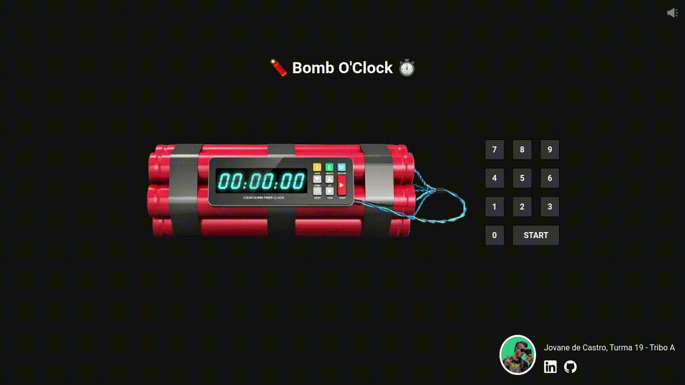
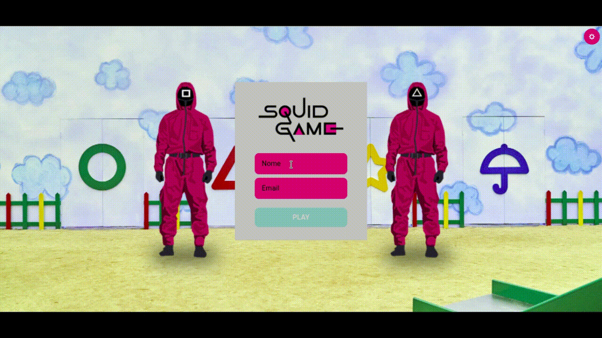
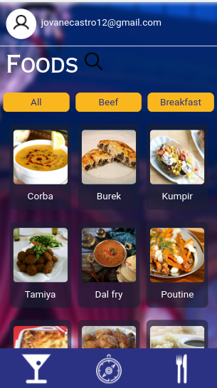
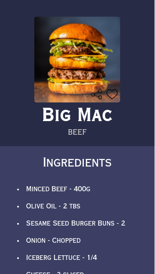

# 🔎 Whoami

My name is Jovane de Castro. Full-stack developer from Brazil 🌎.

    

## 💻 Professional experience

    
     
    
    
    
    
    
     
    2022 - 2024

I've worked for 2 years remotely as Data Engineer in XP Inc. where I could learn a lot about cloud-native applications and how enterprise-grade software is built.
My day-to-day stack include: Python, Azure Devops, Airflow, Kubernetes and Databricks

## 🌐 Currently online works

    
     
    Built using NextJS
    
     
    See it live <a href="https://dalierp.com.br/">here</a>

    
     
    Deployed on Hostinger
    
     
    Built using ReactJS
    
     
    See it live <a href="https://ruacrew.com.br/">here</a>

## 🏆 Proudly completed side-projects

    
     
    Python

### [Twitterbot 🐦](https://github.com/Cadavanaugh/Twitterbot)
GUI application that retweets when finds keywords in public tweets.

    
     
    Built using Tweepy
    
     
    Used Tkinter for the GUI
    
     
    Available for download <a href="https://www.mediafire.com/file/54aswhwjw6d36lw/Twitterbot.exe/file">here</a>
    
     
    Video tutorial <a href="https://www.youtube.com/watch?v=M0GNUXA-H4Q">here</a>
    

---

    
     
    Trybe

### [Bomb O'Clock 💣](https://github.com/Cadavanaugh/Bomb-O-Clock)
I coded Bomb O'clock for my 10min class breaks at Trybe ⏲

    
     
    Built using ReactJS
    
     
    Context API manages application state
    
     
    Deployed on Github Pages
    
     
    See it live <a href="https://cadavanaugh.github.io/Bomb-O-Clock/">here</a>

### [Squid Game Quiz 🎮](https://github.com/Cadavanaugh/Trybe-Project-Trivia)

    
     
    Built using ReactJS
    
     
    OPEN TRIVIA DB API consumption
    
     
    Redux manages application state
    
     

### [Recipes App 👨‍🍳](https://github.com/Cadavanaugh/Trybe-Project-Recipes-App)

    
    
    
     
    Built using ReactJS
    
     
    TheMealsDB API consumption
    
     
    TheCocktailDB API consumption
    
     
    Context API manages application state
    
     

