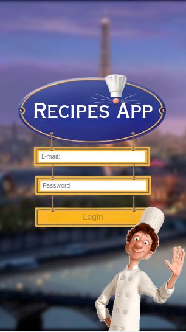

# 🔎 Whoami

My name is Jovane de Castro. Full-stack developer from Brazil 🌎.

    

## 💻 Experience

    
     
    
    
    
    
    
     
    2022 - 2024

I've worked for 2 years remotely as Data Engineer in XP Inc. where I could learn a lot about cloud-native applications and how enterprise-grade software is built.
My day-to-day stack include: Python, Azure Devops, Airflow, Kubernetes and Databricks

## 🌐 Currently online works

    
     
    <a href="https://dalierp.com.br/">DALI</a>

    
     
    <a href="https://ruacrew.com.br/">R.U.A. Crew</a>

## 🏆 Proudly completed side-projects

    
     
    Python

- <a href='https://github.com/Cadavanaugh/Twitterbot'> Twitterbot 🐦</a> - GUI application that retweets given keywords found in twitter. In this project I consume the Twitter API through the **Tweepy** library. I used **tkinter** to create the graphical user interface.

    

---

    
     
    Javascript

- <a href='https://github.com/Cadavanaugh/Bomb-O-Clock'>Bomb O'Clock 💣</a> - A countdown timer-bomb. I coded Bomb O'clock for my 10min class breaks at Trybe. Built with **ReactJS**. **Context API** manages the application state.

    

---

    
     
    Trybe

- <a href='https://github.com/Cadavanaugh/Trybe-Project-Trivia'>Squid Game Quiz 🎮</a> - Squid Games thematic trivia game. This project consumes the **OPEN TRIVIA DB** API. Team-developed with **React & Redux**.

    

- <a href='https://github.com/Cadavanaugh/Trybe-Project-Recipes-App'>Recipes App 👨‍🍳</a> - Ratatouille Recipes WebApp. This project consumes the **TheMealsDB API** & **TheCocktailDB API**. Team-developed with **Context API**.

    
    
    

